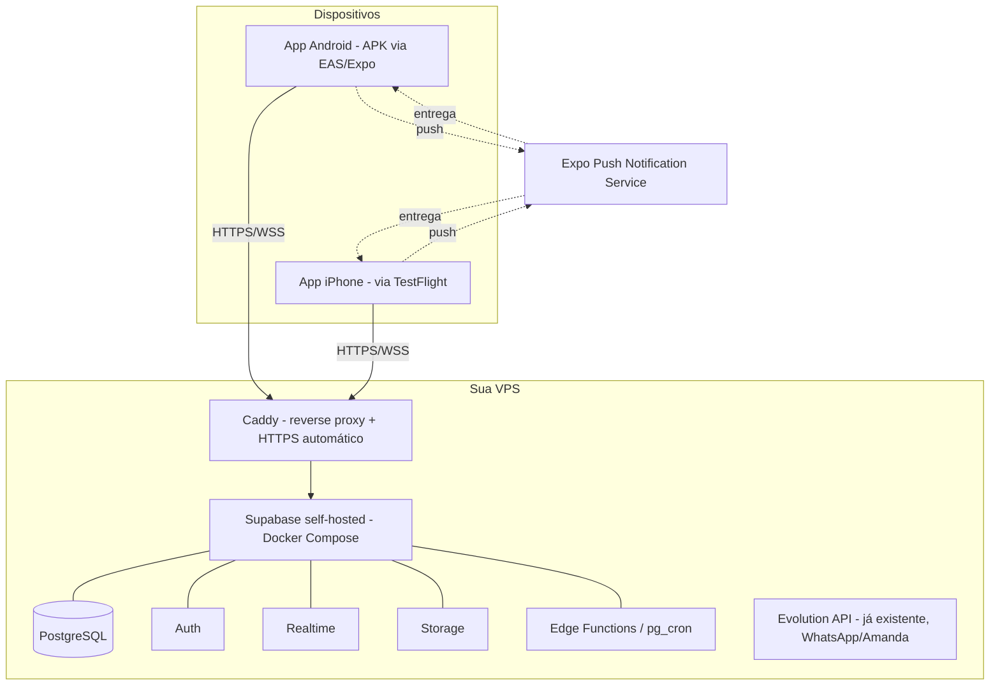

# App do Casal — Documento de Projeto e Arquitetura

> **Como usar este documento:** este arquivo foi escrito para ser colado/aberto diretamente no Claude Code como briefing inicial. Ele contém escopo, decisões técnicas, modelo de dados e um roadmap por fases. Onde eu assumi uma decisão em vez de perguntar, marquei como **[PREMISSA]** — revise essas partes antes de mandar o Claude Code começar a codar, ou simplesmente deixe como está e ajuste depois.

---

## 1. Visão geral

Um app privado para dois usuários fixos (você e sua namorada), rodando no seu próprio servidor (VPS), reunindo:

1. **Acompanhamento de ciclo menstrual** (inspirado no Flow)
2. **Recursos de casal** (inspirado no Love8): mural de momentos, "toques" de saudade, contador de dias, datas importantes, chat privado
3. **Minigames** para jogarem juntos
4. **Pet virtual** do casal para cuidarem juntos
5. **Modo casa** estilo The Sims para decorar um espaço juntos
6. **Avatares** customizáveis
7. **Sistema de moedas** (ganho diário + por tarefas + por minigames, gasto em pets/roupas/casa)
8. **Chat/mensagens** entre vocês dois dentro do próprio app

Não é um produto para o público — é um app de dois usuários. Isso muda bastante a arquitetura: nada de multi-tenant, sistema de pareamento de casais, moderação de conteúdo, etc. Isso simplifica MUITO o projeto comparado aos apps reais que inspiraram a ideia.

---

## 2. O que aprendemos pesquisando Love8 e Flow

### Love8 (referência de "coisas de casal")
Pesquisei o site oficial, App Store, Google Play e reviews. Os pilares do produto são:

- **Compartilhamento de localização** em tempo real, velocidade e "há quanto tempo está parado" <cite index="12-1,12-2">o app foca em recursos de localização para casais que querem ficar próximos, com widgets, memórias compartilhadas e momentos do relacionamento</cite>
- **Nível de bateria do parceiro** com alerta antes de descarregar
- **Widgets de tela inicial** mostrando status do casal
- **Histórias/Stories** — registro da vida diária, momentos doces
- **Efeitos "sinto sua falta"** — envio de toques/efeitos românticos que aparecem na tela do parceiro na hora
- **Pet virtual do casal** <cite index="7-1">interações com um pet virtual criado como forma de trazer diversão e leveza para o relacionamento, além de fazer o pet crescer junto com o casal</cite>
- **Contador de dias / datas importantes** com lembretes recorrentes de aniversário
- Modelo de assinatura premium que libera a maior parte das funções (isso é algo a **evitar** no nosso caso — vamos liberar tudo, já que somos só nós dois)
- Reviews reais apontam bugs de localização, notificação persistente irritante e paywall agressivo — bons exemplos do que **não fazer**.

Vamos aproveitar: pet do casal, mural de momentos/stories, "toques de saudade" via push, contador de dias e datas importantes, widgets (fase tardia). Vamos deixar de fora, por enquanto: compartilhamento de localização em tempo real e bateria (exige permissões pesadas em background e não foi pedido).

### Flow (referência de ciclo)
- Previsão de próxima menstruação e janela fértil, com precisão que melhora após alguns ciclos registrados <cite index="18-1">prevê o próximo período com até 98% de precisão após 3 ciclos, identifica a janela fértil e os dias de ovulação de pico</cite>
- Registro diário de sintomas: cólica, spotting, humor, energia, inchaço <cite index="18-1">registra sintomas como cólicas, spotting, humor, energia e inchaço</cite>
- Fases do ciclo com dicas de energia/comportamento por fase (o app "The Flow" foca bastante nisso) <cite index="25-1">apresenta os pontos positivos de cada fase do ciclo menstrual, com dicas práticas de planejamento</cite>
- Compartilhamento com o parceiro: existe um modo específico para o parceiro acompanhar previsões e fase atual sem entrar em detalhes clínicos <cite index="22-1">o parceiro pode acompanhar atualizações como previsões do ciclo, mantendo controle sobre o que é compartilhado</cite>

Vamos aproveitar: registro diário de sintomas/humor/fluxo, previsão de próximo período e janela fértil (algoritmo simples baseado em média/desvio padrão dos últimos ciclos), tela "fase atual" com dica do dia, e visão do parceiro (você) com o essencial — sem virar um app médico.

---

## 3. Escopo funcional por módulo

### 3.1 Ciclo
- Registrar início/fim do período, intensidade do fluxo, sintomas, humor, notas livres
- Calendário visual do ciclo (fases: menstrual, folicular, ovulação, lútea)
- Previsão do próximo período e janela fértil (após ≥3 ciclos registrados)
- Dica/frase do dia conforme a fase atual
- Tela do parceiro: fase atual + previsão + "como ajudar hoje" — sem exigir que ele veja todos os sintomas detalhados se ela não quiser

### 3.2 Casal (estilo Love8)
- Linha do tempo de momentos/fotos ("stories" privadas dos dois)
- Botões de "toque de saudade" (coração, beijo, abraço) que disparam push instantâneo
- Contador de dias juntos + datas importantes com lembrete configurável
- Indicador de "online agora" (via presence)
- Streak diário (dias seguidos que os dois abriram/interagiram no app)

### 3.3 Chat
- Conversa 1:1 em tempo real entre os dois
- Texto, emoji, envio de foto
- Confirmação de leitura
- Notificação push quando o app está em segundo plano

### 3.4 Minigames
Sugestão de primeira leva (fáceis de implementar com estado em uma tabela + realtime):

| Jogo | Formato | Complexidade |
|---|---|---|
| Jogo da velha | Turnos, tempo real | Baixa |
| Forca colaborativa | Um define a palavra, outro tenta | Baixa |
| Quiz "quem conhece melhor" | Perguntas sobre o parceiro, pontuação | Baixa |
| Jogo da memória | Ranking de tempo, cada um joga seu tabuleiro | Baixa |
| Damas | Turnos, tempo real | Média |
| Truco/UNO simplificado | Turnos, cartas | Média-alta (fase tardia) |

Cada minigame ganho gera recompensa em moedas.

**Regras resumidas de cada jogo (pra especificar o `state` jsonb de `minigame_matches`):**

- **Jogo da velha:** tabuleiro 3x3, turnos alternados, `state = { board: [9], current_turn }`. Vitória por linha/coluna/diagonal ou empate.
- **Forca colaborativa:** um usuário define a palavra (tela separada, não visível pro outro), o outro tenta adivinhar letra a letra. `state = { word_masked, guessed_letters, attempts_left }`.
- **Quiz "quem conhece melhor":** banco de perguntas pré-cadastradas (ex: "qual a comida favorita dele(a)?"), cada um responde sobre o parceiro E prevê a resposta do parceiro sobre si mesmo; pontua quando a previsão bate com a resposta real. `state = { question_id, answers: {user_id: resposta}, predictions: {user_id: previsão} }`.
- **Jogo da memória:** grid de cartas viradas, cada um joga seu próprio tabuleiro (mesmo layout, seed compartilhada) contra o tempo; ranking por tempo/tentativas. `state = { grid, flipped, matched, time_ms }`.
- **Damas:** tabuleiro 8x8 padrão, regras clássicas de captura obrigatória e promoção a dama. `state = { board: [64], current_turn, captured_pieces }`.
- **Truco/UNO simplificado (fase avançada):** versão reduzida de 2 jogadores; vale prototipar com regras simplificadas antes de tentar as regras completas do truco mineiro/paulista.

Todos os jogos turno-a-turno usam o mesmo padrão: uma linha em `minigame_matches`, `state` atualizado a cada jogada, e um canal de **Supabase Realtime Broadcast** por partida pra notificar o parceiro em tempo real sem precisar dar refresh.

### 3.5 Pet virtual
- Um pet do casal (não um pet por pessoa — reforça a ideia de cuidar juntos)
- Status: fome, humor, energia, que decaem com o tempo (job periódico)
- Ações: alimentar, brincar, banhar — cada ação custa tempo de espera (cooldown) ou moedas
- Evolução visual por nível/idade (sprite composto por camadas, como um avatar)
- Loja de itens do pet, em três categorias: **comida** (recupera fome, algumas dão bônus de humor), **brinquedos** (recuperam humor/energia, alguns são "jogos" com o pet tipo buscar bolinha), **acessórios cosméticos** (coleira, chapéu, etc — puramente visual, não afeta status)
- Espécie do pet escolhida uma vez no começo (ex: cachorro, gato, dragão fofo) dentre um catálogo pequeno inicial (3-4 opções), cada uma com seu próprio conjunto de camadas de sprite

### 3.6 Casa (estilo The Sims) **[PREMISSA: modo 2D em grid]**
Você não respondeu essa parte diretamente, então assumi o formato mais viável para um dev solo em React Native: **2D top-down em grid** (tipo Animal Crossing/Toca Boca), não isométrico 3D. Dá para editar depois se quiser evoluir para 2.5D isométrico — a estrutura de dados (grid de células com item + posição + rotação) é a mesma, muda só o motor de renderização.

- Um cômodo/casa compartilhado (não um por pessoa), que cresce em número de cômodos desbloqueáveis conforme progresso (ex: começa só com a sala, desbloqueia quarto e cozinha depois — dá objetivo de longo prazo pro sistema de moedas)
- Grid de células; cada célula pode ter um item de mobília (item tem `width`/`height` em células, pra permitir móveis maiores que 1x1)
- Drag-and-drop para posicionar/mover/girar itens (rotação em 4 direções pra dar mais liberdade de arranjo)
- Loja de mobília por categoria: **estrutural** (piso, parede, papel de parede), **móveis** (sofá, cama, mesa, estante), **decoração** (quadros, plantas, tapetes), **eletrônicos** (TV, som — podem ter pequenas animações)
- Mudanças salvas no banco a cada alteração; quando os dois estão online ao mesmo tempo, sincroniza em tempo real via Supabase Realtime (Broadcast no canal `house:updates`), com um indicador simples de "quem está mexendo agora" pra evitar sobrescrever a mudança um do outro

### 3.7 Avatares
- Customização em camadas, cada uma independente e combinável: **base** (tom de pele, tipo de corpo), **rosto** (olhos, boca, sobrancelha), **cabelo** (corte + cor), **roupa de cima**, **roupa de baixo**, **calçado**, **acessório de cabeça** (boné, óculos, laço), **acessório extra** (colar, mochila)
- Guarda-roupa: itens comprados na loja com moedas, "equipados" no avatar (uma peça ativa por camada por vez, mas o inventário guarda tudo que já foi comprado)
- Avatar aparece no chat, no perfil, no ranking dos minigames, e pode aparecer dentro do modo casa como um "boneco" andando pelo cômodo (fase avançada)
- Renderização: camadas empilhadas como imagens PNG transparentes na ordem correta (base → roupa de baixo → roupa de cima → calçado → cabelo → rosto → acessórios), ou equivalente em `react-native-svg` se optarem por vetor

### 3.8 Sistema de moedas ("Corações")
- Saldo por usuário
- Ganhos: check-in diário (streak), tarefas concluídas, vitória em minigame
- Gastos: itens de pet, roupas de avatar, mobília da casa
- Ledger de transações (auditoria simples, evita bug de saldo)

### 3.9 Tarefas/missões
- Lista de tarefas do casal (pode ser afazeres reais tipo "levar o lixo" ou missões de relacionamento tipo "mandem uma mensagem fofa hoje")
- Frequência: diária, semanal, única
- Recompensa em moedas ao concluir

---

## 4. Premissas assumidas (revise antes de começar)

| Ponto | Premissa assumida | Alternativa |
|---|---|---|
| Modo casa | Grid 2D top-down | Isométrico 2.5D (mais bonito, mais trabalho) |
| Formato do documento | Roadmap em fases (MVP primeiro) | Tudo de uma vez |
| Backend | Supabase self-hosted (Docker) na sua VPS | FastAPI + PostgreSQL + WebSockets, reaproveitando seu stack Python já usado no agente local |
| Distribuição iOS | **AltStore** (grátis) — AltServer rodando no seu PC Windows, renova o app automaticamente via Wi-Fi | Apple Developer Program (US$ 99/ano) + TestFlight, se um dia quiser trocar pelo caminho mais estável e sem depender do PC ligado |
| "Casal" no banco | Não existe conceito de "pareamento" — são 2 usuários fixos cadastrados manualmente | — |
| Escopo | Construir o escopo completo (todos os módulos), organizado em uma ordem de execução — não um MVP que corta funcionalidades | — |

---

## 5. Arquitetura



**Por que Supabase self-hosted em vez de Supabase Cloud:** você pediu servidor na sua própria VPS. O self-hosted te dá Postgres + Auth + Realtime + Storage prontos via `docker compose up`, reaproveitando exatamente o que você já domina do projeto da barbearia (RLS, client SDK, padrões de tabela) — só que apontando pro seu próprio domínio em vez do Supabase Cloud.

**Atenção a recursos da VPS:** o stack completo do Supabase self-hosted sobe ~10 containers (Postgres, Kong, GoTrue, Realtime, Storage, Studio, etc.) e geralmente pede pelo menos 2 GB de RAM livres, idealmente 4 GB+. Antes de começar, vale checar quanto de RAM/CPU sobra na VPS além do que a Evolution API já usa. Se estiver apertado, a alternativa é o backend leve com FastAPI + PostgreSQL + WebSockets (Auth você mesmo implementa com JWT simples, viável porque são só 2 usuários fixos; Realtime vira um WebSocket manager simples).

---

## 6. Stack tecnológica

| Camada | Tecnologia | Por quê |
|---|---|---|
| App mobile | **React Native + Expo** (SDK atual, Expo Router) | Um código só pra Android e iOS; build de APK e IPA gerenciado pelo EAS |
| Estado global | **Zustand** | Leve, sem boilerplate |
| Estado de servidor/cache | **TanStack Query** | Cache, refetch automático, updates otimistas (importante pro pet/loja/chat parecerem instantâneos) |
| Backend | **Supabase self-hosted (Docker)** na VPS | Postgres + Auth + Realtime + Storage prontos |
| Alternativa mais leve | **FastAPI + PostgreSQL + WebSockets** | Reaproveita seu stack Python já validado no agente local |
| Realtime (chat, presence, minigames, sync da casa) | **Supabase Realtime** (Postgres Changes + Broadcast + Presence) | Nativo, sem serviço extra |
| Notificações push | **Expo Push Notifications** | Grátis, cross-platform, sem configurar FCM/APNs na mão |
| Armazenamento de fotos/assets | **Supabase Storage** | Já integrado ao stack |
| Proxy/HTTPS | **Caddy** | Certificado automático, config mínima |
| Build Android | **EAS Build local** ou cloud (`eas build --platform android`) | Gera `.apk` direto pra instalar |
| Build/distribuição iOS | **EAS Build cloud** + Apple Developer Program + **TestFlight** | Único caminho estável pra instalar num iPhone sem Mac |
| Renderização de avatar/pet | Camadas de imagem (PNG transparente) compostas em `View`/`Image` empilhados, ou `react-native-svg` se preferir vetor | Simples, performático, fácil de expandir com novos itens de guarda-roupa |
| Jobs periódicos (decaimento do pet, previsão de ciclo, reset de streak) | `pg_cron` + Edge Function (se Supabase) ou APScheduler em container Python (se FastAPI) | Reaproveita padrão que você já usa nos seus agentes |

---

## 7. Modelo de dados (visão geral)

> Convenção: todas as tabelas com `user_id` referenciam uma tabela `users` com só 2 linhas fixas (você e ela). Não existe conceito de "convite" ou "pareamento" — o cadastro dos 2 usuários é feito manualmente na primeira configuração.

```
users
  id, name, role ('bazot' | 'namorada'), avatar_config (jsonb), created_at

cycle_logs
  id, user_id, start_date, end_date, flow_intensity, symptoms (jsonb), mood, notes, created_at

cycle_predictions
  id, user_id, predicted_next_start, fertile_window_start, fertile_window_end,
  current_phase, calculated_at

wallets
  user_id, balance

wallet_transactions
  id, user_id, amount, direction ('earn'|'spend'), source ('daily_checkin'|'task'|'minigame'|'purchase'),
  reference_id, created_at

tasks
  id, title, description, assigned_to (user_id, nullable = ambos), frequency ('once'|'daily'|'weekly'),
  reward_coins, status ('pending'|'done'), completed_at, created_at

shop_items
  id, category ('pet'|'avatar'|'house'), name, price, asset_ref, metadata (jsonb)

inventory
  id, user_id, item_id, acquired_at, equipped (bool)

pet
  id, name, species, level, hunger, happiness, energy, appearance_config (jsonb), last_interaction_at

pet_interaction_logs
  id, pet_id, user_id, action ('feed'|'play'|'bathe'), created_at

house_layout
  id, grid_data (jsonb), updated_at, updated_by

avatars
  user_id, config (jsonb: skin, hair, eyes, outfit, accessories), updated_at

messages
  id, sender_id, content, type ('text'|'image'|'sticker'), read_at, created_at

minigame_matches
  id, game_type, status ('waiting'|'in_progress'|'finished'), player1_score, player2_score,
  state (jsonb), started_at, finished_at

important_dates
  id, title, date, repeat_yearly (bool), reminder_days_before

daily_streak
  user_id, current_streak, last_checkin_date

love_taps
  id, sender_id, type ('heart'|'kiss'|'hug'), created_at
```

Isso dá ~18 tabelas — bem mais enxuto que o sistema da barbearia (39 tabelas), porque aqui não existe multi-tenant, multi-cliente ou billing.

---

## 8. Estrutura de pastas sugerida (monorepo)

```
app-casal/
├── apps/
│   └── mobile/                        # Expo React Native
│       ├── app/                       # Expo Router
│       │   ├── (auth)/
│       │   │   └── login.tsx
│       │   └── (tabs)/
│       │       ├── home.tsx           # feed de momentos, streak, toques de saudade
│       │       ├── cycle/
│       │       │   ├── index.tsx      # calendário + fase atual
│       │       │   ├── log.tsx        # registrar sintomas/humor/fluxo
│       │       │   └── partner-view.tsx
│       │       ├── pet/
│       │       │   ├── index.tsx      # tela principal do pet (status + ações)
│       │       │   └── history.tsx
│       │       ├── house/
│       │       │   ├── index.tsx      # editor de grid
│       │       │   └── rooms.tsx      # desbloqueio de cômodos
│       │       ├── games/
│       │       │   ├── index.tsx      # lobby de jogos
│       │       │   ├── tic-tac-toe.tsx
│       │       │   ├── hangman.tsx
│       │       │   ├── quiz.tsx
│       │       │   ├── memory.tsx
│       │       │   └── checkers.tsx
│       │       ├── shop/
│       │       │   ├── index.tsx
│       │       │   ├── pet-items.tsx
│       │       │   ├── avatar-items.tsx
│       │       │   └── house-items.tsx
│       │       ├── chat.tsx
│       │       ├── tasks.tsx
│       │       └── profile/
│       │           ├── index.tsx
│       │           └── avatar-editor.tsx
│       ├── components/
│       │   ├── avatar/                # renderizador de camadas
│       │   ├── pet/
│       │   ├── house/
│       │   ├── games/
│       │   └── ui/                    # componentes genéricos
│       ├── lib/
│       │   ├── supabase.ts            # cliente apontando pra VPS
│       │   ├── push.ts                # registro de push token
│       │   └── realtime.ts            # helpers de canais (chat, presence, jogos, casa)
│       ├── store/                     # zustand: auth, wallet, avatar, pet, house
│       └── assets/
│           ├── avatar-layers/
│           ├── pet-sprites/
│           └── furniture/
├── infra/
│   ├── docker-compose.yml             # stack self-hosted Supabase
│   ├── caddy/Caddyfile
│   └── backup/                        # script de pg_dump agendado
├── packages/
│   └── shared/                        # tipos TS, constantes de jogo, schema compartilhado
├── supabase/
│   ├── migrations/                    # SQL das ~18 tabelas + RLS
│   └── functions/                     # Edge Functions: previsão de ciclo, decaimento do pet, reset diário
└── docs/
    └── projeto-app-casal.md           # este arquivo
```

---

## 9. Build e distribuição

### Android (você)
1. `eas build --platform android --profile preview` (gera `.apk` direto, sem passar pela Play Store)
2. Baixa o `.apk` e instala manualmente (ou via link, ou transferindo por USB/WhatsApp)
3. Build local com Android Studio/Gradle também é opção sem depender de cota do EAS

### iPhone (ela) — caminho gratuito escolhido: **AltStore**

Como você optou por não pagar o Apple Developer Program, o fluxo é:

1. Gere o build iOS com `eas build --platform ios --profile preview` usando um **Apple ID pessoal grátis** (sem Developer Program) — o EAS consegue assinar builds ad-hoc com conta free, só que com validade de 7 dias por build.
2. Instale o **AltServer** no seu PC Windows (é o companion do AltStore, roda em background).
3. No iPhone dela, instale o **AltStore** via AltServer (conecta o iPhone no PC uma vez via cabo/USB pra essa etapa inicial, ou via Wi-Fi se configurar o "AltServer sem fio").
4. Instale o `.ipa` gerado pelo EAS através do AltStore.
5. Deixe o **AltServer aberto no seu PC e o iPhone dela na mesma rede Wi-Fi** pelo menos 1x a cada 7 dias — o AltStore renova a assinatura do app automaticamente nesse intervalo, sem precisar reinstalar manualmente.

**Trade-offs a aceitar com esse caminho:**
- Depende do seu PC estar ligado e na mesma rede pelo menos semanalmente pra renovar (dá pra automatizar deixando o AltServer como serviço de inicialização do Windows).
- Se a Apple mudar algo nesse mecanismo, pode quebrar — é um caminho não-oficial. Se isso acontecer, o fallback documentado é migrar pra Apple Developer Program + TestFlight (US$ 99/ano), que resolve de vez.
- Cada renovação exige o iPhone dela estar minimamente por perto da rede — não funciona 100% "no ar" como um app da App Store.

### Android (você) — sem mudanças
Build `.apk` via EAS (local ou cloud), instalação direta, sem loja e sem esse tipo de expiração.

---

## 10. Notificações e jobs periódicos

- **Push via Expo:** token salvo por usuário/dispositivo; dispara em: toque de saudade, nova mensagem, tarefa atribuída, previsão de período se aproximando, streak em risco de quebrar
- **Job diário:** recalcular previsão de ciclo, resetar tarefas diárias, verificar quebra de streak
- **Job periódico (ex: a cada 3h):** decair status do pet (fome/energia/humor)

---

## 11. Plano de execução do escopo completo

Este não é um MVP que corta funcionalidades — é **todo o escopo da seção 3**, só que organizado numa ordem de construção que respeita dependências técnicas (ex: não dá pra ter chat sem auth, não dá pra ter loja sem sistema de moedas). O Claude Code deve seguir essa ordem, mas o alvo final é o app completo, com todos os 9 módulos funcionando.

### Etapa 1 — Infraestrutura e base
- Monorepo (`apps/mobile`, `infra/`, `packages/shared`)
- `docker-compose.yml` do Supabase self-hosted na VPS + Caddy com HTTPS automático
- Schema completo do banco (todas as ~18 tabelas da seção 7, de uma vez, com RLS)
- Auth de 2 usuários fixos (login com senha, sessão persistida no app)
- Expo app inicial com Expo Router, navegação por abas já com as 8 seções (Home, Ciclo, Pet, Casa, Jogos, Loja, Chat, Perfil) — mesmo que boa parte comece vazia/placeholder
- Push notifications configuradas (token salvo por dispositivo) — usada por todos os módulos depois

### Etapa 2 — Identidade e economia (base pra tudo que envolve compra)
- Avatar completo: todas as camadas de customização (seção 3.7) e tela de edição
- Sistema de moedas completo: carteira, ledger de transações, check-in diário com streak
- Módulo de tarefas/missões completo (criação, atribuição, conclusão, recompensa)
- Loja unificada (tela única com abas por categoria: pet / avatar / casa), já preparada para receber itens dos módulos seguintes

### Etapa 3 — Ciclo e casal
- Módulo de ciclo completo: registro, calendário, algoritmo de previsão, tela do parceiro, dicas por fase
- Módulo de casal completo: toques de saudade, contador de dias, datas importantes, mural de momentos/stories, indicador de presença online
- Chat 1:1 completo: texto, emoji, foto, confirmação de leitura, push

### Etapa 4 — Pet e casa
- Pet virtual completo: status com decaimento por job periódico, interações (alimentar/brincar/banhar), evolução visual por nível, itens de loja específicos do pet
- Modo casa completo: grid 2D, catálogo de mobília por categoria, drag-and-drop, sincronização em tempo real quando os dois estão online juntos

### Etapa 5 — Minigames
- Implementar todos os jogos da tabela da seção 3.4, na ordem de complexidade: velha → forca colaborativa → quiz "quem conhece melhor" → memória → damas → truco/UNO simplificado
- Cada jogo ganho já integrado ao sistema de moedas desde o primeiro implementado

### Etapa 6 — Polimento e recursos avançados
- Widgets de tela inicial (Android primeiro, iOS se viável dentro do AltStore)
- Mais itens de guarda-roupa/mobília/pet pra aprofundar a economia
- Animações, sons, transições
- Ajustes finos de UX depois de vocês dois usarem o app por um tempo

---

## 12. Riscos e pontos de atenção

- **Recursos da VPS:** confirme RAM/CPU livres antes de subir o Supabase self-hosted completo; se estiver curto, use a alternativa FastAPI mais leve.
- **Backup do banco:** configure dump automático do Postgres (cron + `pg_dump` pra um storage externo/backup remoto) — é o único banco de dados de vocês dois, sem isso um erro derruba tudo.
- **Distribuição iOS via AltStore:** exige disciplina de manter o AltServer rodando no PC e o iPhone dela passando pela mesma rede Wi-Fi ao menos 1x por semana, ou o app expira e precisa reinstalar na mão. Vale configurar o AltServer pra iniciar automaticamente com o Windows e, se possível, deixar o PC sempre ligado/em modo baixo consumo.
- **Dados sensíveis do ciclo:** mesmo sendo só vocês dois, vale pensar se ela quer que todos os sintomas sejam visíveis pra você por padrão, ou só um resumo de fase/previsão — dá pra deixar configurável.
- **Escopo grande:** o projeto completo (ciclo + casal + chat + minigames + pet + casa + avatar + moedas) é bastante coisa pra construir sozinho. O roadmap em fases existe justamente pra vocês terem algo usável (Fase 1) rápido, em vez de esperar tudo pronto de uma vez.

---

## 13. Custos estimados

| Item | Custo |
|---|---|
| VPS | Já existente (reaproveitada) |
| Domínio/subdomínio | Você já tem `barbeariabazot.com`; pode usar um subdomínio tipo `app.seudominio.com` ou registrar um novo domínio pessoal |
| Supabase self-hosted | Grátis (open source) |
| Expo/EAS | Grátis no plano free (limite de builds/mês na nuvem; build local ilimitado) |
| Distribuição iOS | **Grátis** — AltStore/AltServer (caminho escolhido). Apple Developer Program (US$ 99/ano) fica como upgrade futuro opcional, só se o AltStore der trabalho demais |
| Push notifications | Grátis (Expo) |

---

## 14. Prompt sugerido para começar no Claude Code

```
Este é o projeto app-casal. Leia o documento docs/projeto-app-casal.md completo antes de
começar. O objetivo é construir o escopo COMPLETO descrito na seção 3 (ciclo, casal, chat,
minigames, pet, casa, avatar, moedas, tarefas) — não é pra parar num MVP reduzido. Siga a
ordem de execução da seção 11 (Etapa 1 a 6) porque ela respeita dependências técnicas, mas
o alvo de cada etapa é entregar o módulo por completo, não uma versão cortada. Use o modelo
de dados da seção 7 e a estrutura de pastas da seção 8 como referência. A distribuição no
iPhone é via AltStore (seção 9) — não configure caminho de App Store/TestFlight a menos que
eu peça. Pergunte antes de tomar decisões de arquitetura não cobertas aqui.
```

---

*Documento gerado como briefing técnico — pesquisa baseada em Love8 (App Store/Google Play/site oficial) e Flow (App Store/Google Play/site oficial), agosto de 2026.*
